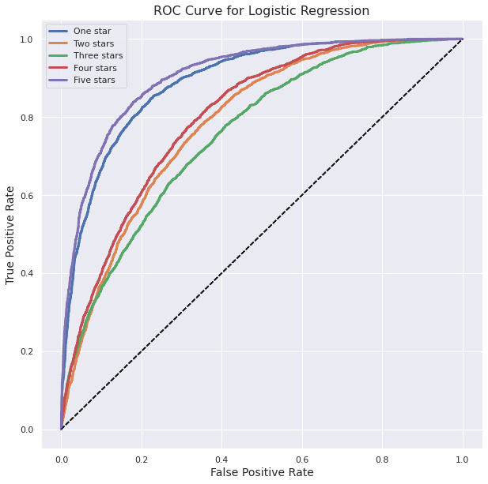

# Exploring Star Ratings - Regression vs. Classification

We all know that there are differences between 1 star ratings and 5 star ratings. No matter what website you go on, there is a general understanding that 5 star means the product or service met or even exceeded your expectations, and a 1 star rating means that it did not. 

But what is the case for 2,3, and 4 star ratings? Depending on the person, there's a wide range of things that people would consider a 2 star rating, for example. For a lot that could mean "slightly better than 1 star" or depending on the person's mood that day, maybe a slight defect in the product could change their rating from 5 stars to 2 stars. In general, it's hard to draw a line between the middle ratings, as the way people approach rating them varies a lot as well. That being said, is there perhaps a pattern in the language that people use depending on the rating they give?

That is what this project focuses on. Using both a classification and a regression model, it will explore some insights we can gather from constructing these models.

# Data

The movies and TV reviews dataset has around 1.7 million reviews from Amazon, whose character length is above 100. For the purposes of this project, I chose to only consider reviews in the 500-3000 character range to get reviews with a significant body but a reasonable size.

As an enjoyer of movies, I thought this dataset would be really useful for the project. Movies and TV are something that a lot of people feel strongly about, so there would be a lot of emotions present in their reviews. So, the models would be able to use NLP to pick up on them

# Modeling

For the purposes of modeling, I created a balanced dataset, composed of 40,000 reviews from each star rating class, so 200,000 for the whole dataset. This balanced dataset would allow me to use 

This project aims to use both classification and regression to pull insights about the original dataset, first let's start with classification.

## Classification

Trying out a Random Forest, Logistic Classifier, Multinomial Naive Bayes' model and a KNN Classifier, the Logistic Classifier performed the best with an accuracy of 53%. This actually performs well, considering that random guessing in a 5-class model would give 20% accuracy.

This ROC curve does a good job of showing how each category performs in the model. They are evaluated by AUC (Area under curve), so the ones that perform the best are the ones with the most area under the curve. If we go from best-performing to worst-performing, then the best class is 5 stars (purple) followed closely by 1 star (blue). These two are grouped together, which is intuitive. 1 and 5 star ratings are the most polarized, representing when somoene is either very pleased or very displeased with a product. So the model is able to detect these the easiest out of all the classes. There is also the fact that they are the boundary classes, and in a sense will "absorb" all the sentiment that extends past them as well, like if someone was very, VERY displeased with a product, it would still appear in the 1 star class.

If we look a little further down, we can see that 2 stars and 4 stars are also grouped together. Again, this makes sense--these classes are somewhat less defined than the 1 and 5 star classes, but they still have some signal in them that indicates whether they're positive or negative. There is a general understanding that 4 and 2 star rating are less potent versions of 5 and 1 star ratings, so again, this is intuitive.

And at the lowest value, we have the 3 star class represented by the green curve. The 3 star rating posesses qualities of both the 2 and 4 star rating, which are already loosely defined for a lot of people. But this line still performs significantly better than the mean regressor, notated in the dotted black line, so the model does successfully pick up on words that are unique to this class. 

All in all, this ROC curve does a great job at giving an intuitive understanding of how the model is performing on this dataset with regard to the classes, and it reflects our real world understanding of the classses as well.

FEATURE IMPORTANCES

For the logistic model, I also pulled out the feature importances for each class. These gave some very intuitive results:

picture

Notice the absense of any words that relate directly to the topic of Movies and TV. These coefficients pulled from the Logistic Classifier give us a very intuitive and generic list of words pertaining to all of the star classes. However, do we want more information pertaining to the original dataset? Luckily, the Linear Regression addresses some of that.

## Regression

Instead of a model predicting into 5 classes, how about we let the model predict any real number? So, the model would be allowed to predict a 3.75 for example. There are many regression models we can use to accomplish this--I tried Gradient Boosting, Linear Regression, and a Random Forest, but the Linear Regression performed the best out of all of them, with an RMSE of .92.

This means the model was predicting ~1 off from the actual value on average. This isn't very impressive, but luckily the model itself gives us some good information about the dataset.

### Coefficient Matrix

As we did with the Logistic Classifier, we can take the coefficients of the Linear Regression. For this, I sorted by the most positive and negative coefficients, and found the words that corresponded to those. These are the results:

For the positive coefficients, we can see that the first word is "damme". Strange, that doesn't seem like a word about movies, does it? This turns out to refer to Jean-Claude Van Damme, an accomplished film producer. When I looked further into this, it looks like van Damme was a highly controversial figure.

Looking at the negative coefficients, we can see "van damme", the bigram, appears as well. This is very specific information compared to what we got out of the Logistic Regression, so specific that it actually includes someone's name. We also get some information like "Nightmare on Elm", referring of course to the movie. But "timeless" and "propaganda" appear, which aren't hyperspecific but are still specific to this movies and TV dataset. And these words are powerful, timeless is a positive word that expresses that a form of art has value not tied to its time period, and propaganda is a potent term used to describe harmful and insidious media. These are great terms to be able to pull out from our data, and give a great look into some of the nuanced words used to describe movies and TV. However, we lose that level of generality that we got with the Logistic Regression. So, which one of these is better?

There isn't an easy way to answer that, because as shown, these models give very different information. The Logistic Regression categorizes the 5 star ratings well with some generic words that describe each one. The Linear Regression gives a more specific and interesting list of words, with the defecit of potentially too specific of information. But that being said, using both of these models together allowed me to get a greater understanding of the data, more than I would have if I used just one of them. 

# Results

The question I went into this project with was whether or not 2,3, and 4 star ratings could be differentiated from each other, and that was proven to be true. However, something that I learned in the process was how classification models and regresssion models could work together to give insights that normally wouldn't be obtainable by just one or the other.

Something I would be interested in pursuing in the future is applying these same models to other datasets of different topics and seeing if the same thing happens as did happen with the Movies and TV reviews dataset. That is, when I use the Logisitic Classifier will I get a generic description of what each star ratings mean without any reference to the original dataset? And when I use a Linear Regression on the dataset, will it give me more words specific to the dataset? I believe that using both regression and classification in tandem will yield more interesting results for any dataset that I apply it to.

Another interesting experiment would be trying this on a dataset with more rating options, like a dataset that has all the half-ratings (1.5 stars, 4.5 stars, etc.). Is there more nuance to find in the difference between 4 and 4.5 stars? This would be an interesting direction that will likely yield very interesting results.
